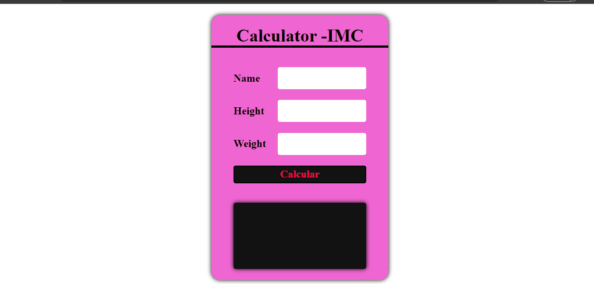
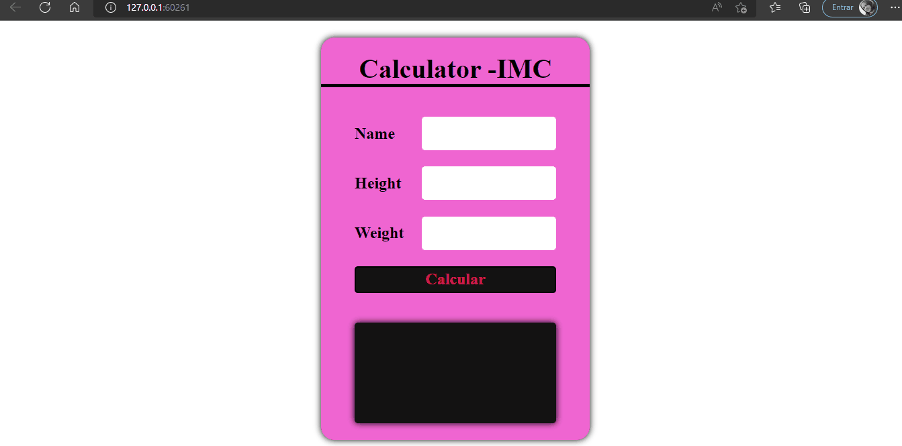

#### Projeto Claculadora IMC

### Desafios interagir com o usuário, mostrando a mensagem que todos os campos devem ser preenchidos. 
##### Como no video abaixo👇

[]

### Ao preencher todos os campos mostrar ao usuário o valor do seu IMC e a mensagem se ele está  "Abaixo do Peso", "Peso ideal"  "Obesidade grau I, II ou III"
##### Como no video abaixo👇

[]

### Tecnologias utilizadas

 

  
  
   
   

[ ]